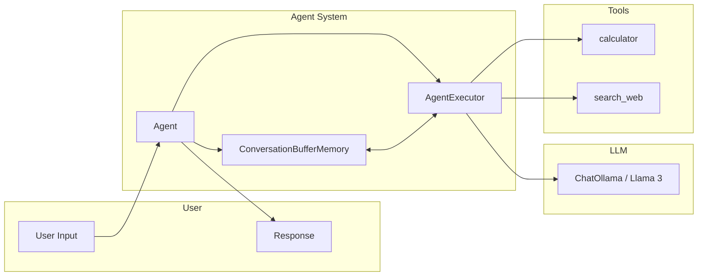
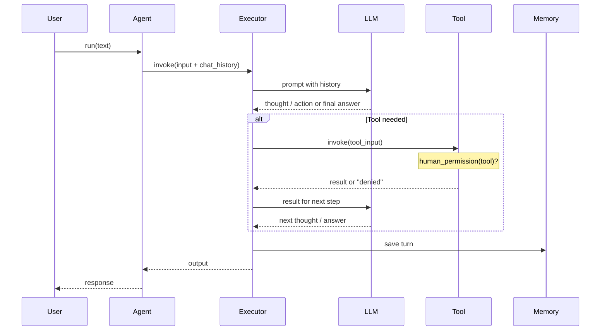
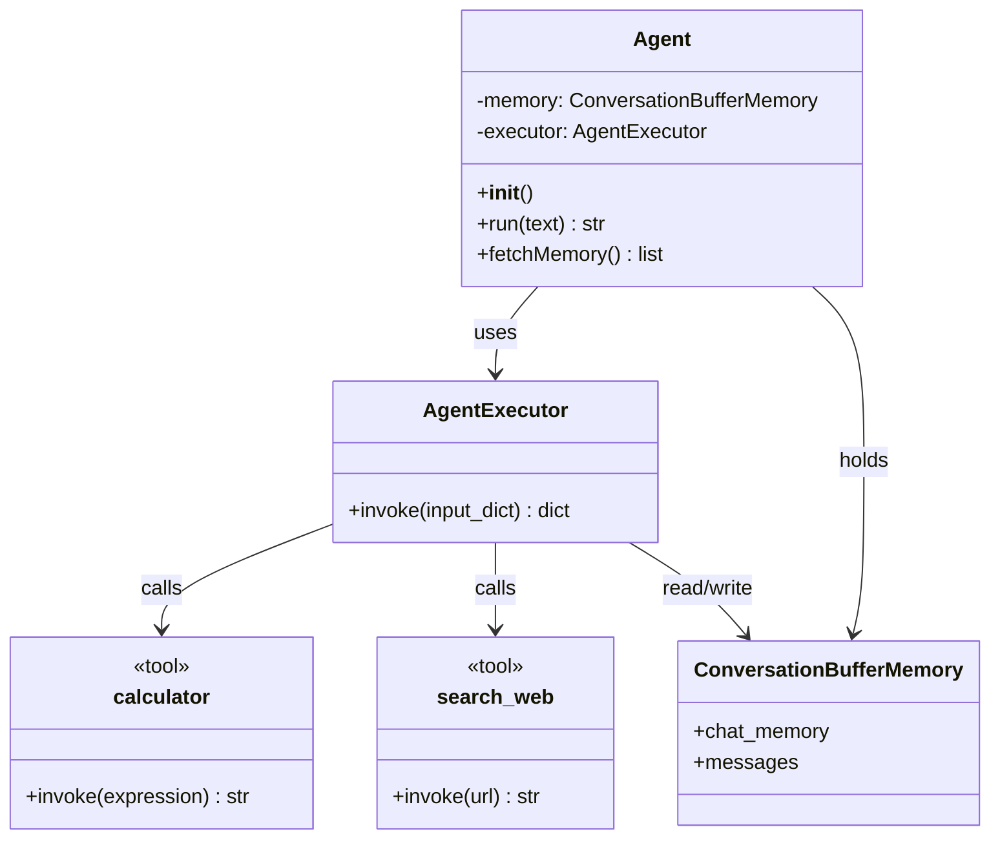

# Agent System Architecture

This document describes how the Co-Polit agent system works: its architecture and main components. For setup and usage, see the [README](../README.md).

---

## Architecture Overview

The agent is a **ReAct-style** (Reasoning + Acting) assistant built with **LangChain**. It uses a local LLM (Ollama with Llama 3), a small set of **tools**, and **conversation memory** to answer user queries. Tool use is gated by **human-in-the-loop** permission prompts.

High-level components:

| Component            | Role                                                                                        |
| -------------------- | ------------------------------------------------------------------------------------------- |
| **Agent**            | Orchestrates the LLM and tools; holds memory and executor.                                  |
| **LLM (ChatOllama)** | Local model (Llama 3) for reasoning and deciding when to use tools.                         |
| **Tools**            | `calculator` (math) and `search_web` (web lookup); both ask user permission before running. |
| **Memory**           | `ConversationBufferMemory` stores chat history for multi-turn dialogue.                     |
| **AgentExecutor**    | Runs the ReAct loop: LLM → tool calls (if any) → LLM until a final answer.                  |

---

## System Architecture (Mermaid)

---

## Request Flow

How a single user message is processed:

---

## Class Diagram (Mermaid)

---

## Main Components

### Agent class (`src/agent.py`)

- **`__init__`**: Creates `ChatOllama` (Llama 3, `localhost:11434`), pulls the `react-chat` prompt from LangChain Hub, builds a ReAct agent with `calculator` and `search_web`, and wraps it in an `AgentExecutor` with `ConversationBufferMemory` and parsing error handling.
- **`run(text)`**: Invokes the executor with `input: text` and returns the final `output` string.
- **`fetchMemory()`**: Returns the list of messages in the conversation buffer (for inspection or debugging).

### Tools

- **`calculator(expression)`**: Evaluates a safe math expression (via `eval` with restricted builtins). Asks the user for permission before running.
- **`search_web(url)`**: Placeholder that returns a result string for the given URL. Also asks for permission before running.

### Human-in-the-loop

- **`human_permission(tool)`**: Prompts the user in the terminal (`yes`/`no`) before the tool runs. If the user says no, the tool returns `"Tool use denied by user."`

---

## Setup & Usage

Prerequisites, installation, running the agent, and running tests are documented in the [main README](../README.md).

---

## Summary

| Aspect           | Description                                                                                                |
| ---------------- | ---------------------------------------------------------------------------------------------------------- |
| **Architecture** | ReAct agent (LangChain) + Ollama LLM + tools + conversation memory.                                        |
| **Flow**         | User → Agent → Executor → LLM (and optionally tools with permission) → response; memory updated each turn. |
| **Classes**      | `Agent` owns the executor and memory; tools are standalone LangChain tools with permission checks.         |

For project structure, roadmap, and contribution guidelines, see the [main README](../README.md).
